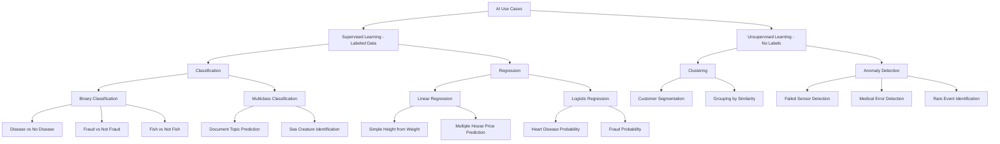

```mermaid
flowchart TD

    A[AI Use Cases] --> B[Supervised Learning - Labeled Data]
    A --> C[Unsupervised Learning - No Labels]

    %% Supervised Branch
    B --> B1[Classification]
    B --> B2[Regression]

    %% Classification
    B1 --> B1a[Binary Classification]
    B1a --> B1a1[Disease vs No Disease]
    B1a --> B1a2[Fraud vs Not Fraud]
    B1a --> B1a3[Fish vs Not Fish]

    B1 --> B1b[Multiclass Classification]
    B1b --> B1b1[Document Topic Prediction]
    B1b --> B1b2[Sea Creature Identification]

    %% Regression
    B2 --> B2a[Linear Regression]
    B2a --> B2a1[Simple Height from Weight]
    B2a --> B2a2[Multiple House Price Prediction]

    B2 --> B2b[Logistic Regression]
    B2b --> B2b1[Heart Disease Probability]
    B2b --> B2b2[Fraud Probability]

    %% Unsupervised Branch
    C --> C1[Clustering]
    C1 --> C1a[Customer Segmentation]
    C1 --> C1b[Grouping by Similarity]

    C --> C2[Anomaly Detection]
    C2 --> C2a[Failed Sensor Detection]
    C2 --> C2b[Medical Error Detection]
    C2 --> C2c[Rare Event Identification]


```
