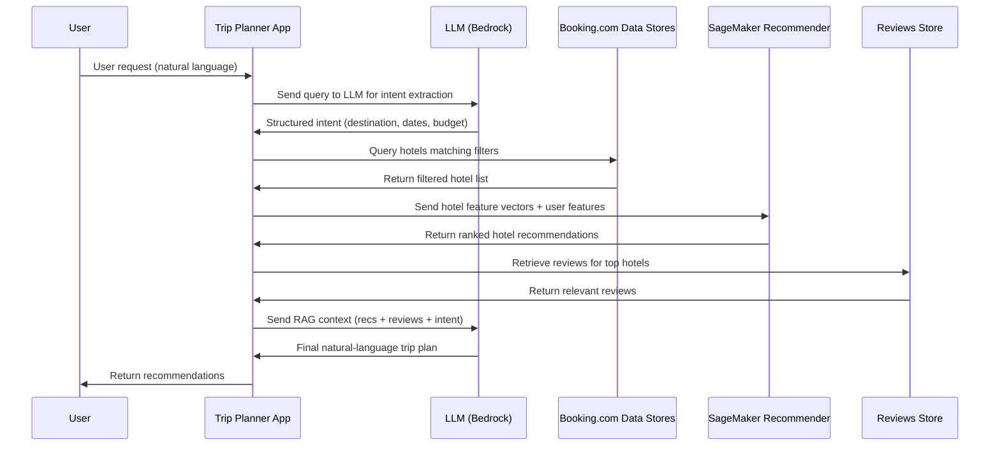

```mermaid
sequenceDiagram
    participant U as User
    participant A as Trip Planner App
    participant L as LLM (Bedrock)
    participant DB as Booking.com Data Stores
    participant SM as SageMaker Recommender
    participant RV as Reviews Store

    U->>A: User request (natural language)
    A->>L: Send query to LLM for intent extraction
    L->>A: Structured intent (destination, dates, budget)

    A->>DB: Query hotels matching filters
    DB->>A: Return filtered hotel list

    A->>SM: Send hotel feature vectors + user features
    SM->>A: Return ranked hotel recommendations

    A->>RV: Retrieve reviews for top hotels
    RV->>A: Return relevant reviews

    A->>L: Send RAG context (recs + reviews + intent)
    L->>A: Final natural-language trip plan

    A->>U: Return recommendations

```
