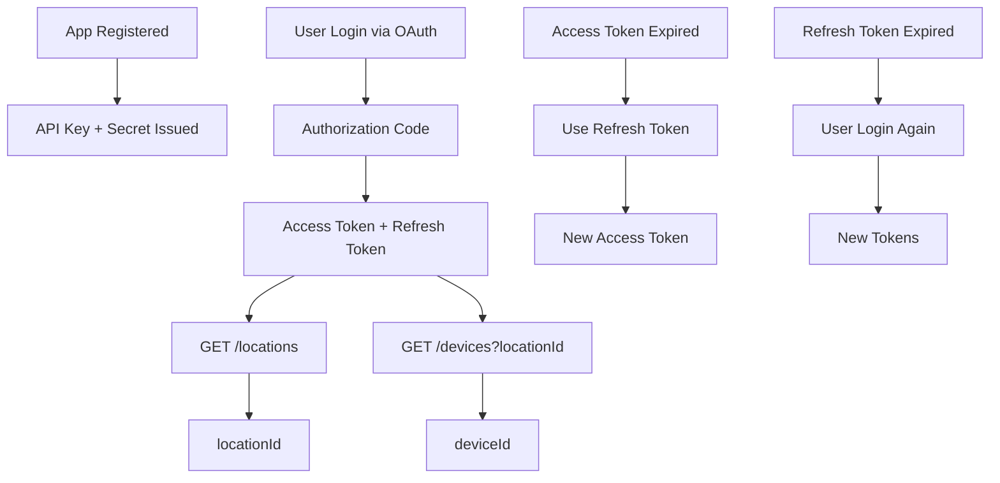

```mermaid
flowchart TD

    %% Permanent credentials
    A[App Registered] --> B[API Key + Secret Issued]

    %% OAuth flow
    C[User Login via OAuth] --> D[Authorization Code]
    D --> E[Access Token + Refresh Token]

    %% Using access token
    E --> F[GET /locations]
    F --> G[locationId]

    E --> H[GET /devices?locationId]
    H --> I[deviceId]

    %% Expiration handling
    J[Access Token Expired] --> K[Use Refresh Token]
    K --> L[New Access Token]

    M[Refresh Token Expired] --> N[User Login Again]
    N --> O[New Tokens]
```
